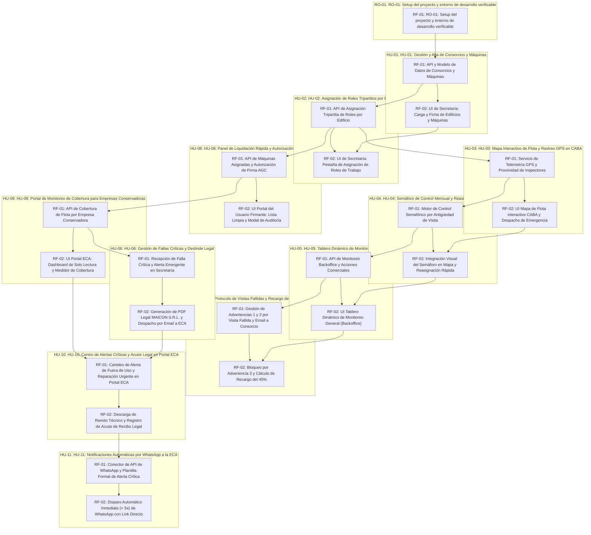

# Grafo de Dependencias -- mant_asc

_Generado automaticamente el 2026-10-13T17:00:40.656Z -- no editar a mano, se sobreescribe en cada publicacion._

```mermaid
graph TD
  subgraph US_1791560828588["RO-01: RO-01: Setup del proyecto y entorno de desarrollo verificable"]
    REQ_1791560828605["RF-01: RO-01: Setup del proyecto y entorno de desarrollo verificable"]
  end
  subgraph US_1791560828711["HU-01: HU-01: Gestión y Alta de Consorcios y Máquinas"]
    REQ_1791909582859["RF-01: API y Modelo de Datos de Consorcios y Máquinas"]
    REQ_1791910394885["RF-02: UI de Secretaría: Carga y Ficha de Edificios y Máquinas"]
  end
  subgraph US_1791560828789["HU-02: HU-02: Asignación de Roles Tripartitos por Edificio"]
    REQ_1791910395002["RF-01: API de Asignación Tripartita de Roles por Edificio"]
    REQ_1791910395101["RF-02: UI de Secretaría: Pestaña de Asignación de Roles de Trabajo"]
  end
  subgraph US_1791560828900["HU-03: HU-03: Mapa Interactivo de Flota y Rastreo GPS en CABA"]
    REQ_1791910395196["RF-01: Servicio de Telemetría GPS y Proximidad de Inspectores"]
    REQ_1791910395292["RF-02: UI Mapa de Flota interactivo CABA y Despacho de Emergencia"]
  end
  subgraph US_1791560828979["HU-04: HU-04: Semáforo de Control Mensual y Reasignación Operativa"]
    REQ_1791910395389["RF-01: Motor de Control Semafórico por Antigüedad de Visita"]
    REQ_1791910395476["RF-02: Integración Visual del Semáforo en Mapa y Reasignación Rápida"]
  end
  subgraph US_1791560829061["HU-05: HU-05: Tablero Dinámico de Monitoreo Backoffice"]
    REQ_1791910395565["RF-01: API de Monitoreo Backoffice y Acciones Comerciales"]
    REQ_1791910395676["RF-02: UI Tablero Dinámico de Monitoreo General (Backoffice)"]
  end
  subgraph US_1791560829152["HU-06: HU-06: Gestión de Fallas Críticas y Deslinde Legal"]
    REQ_1791910396411["RF-01: Recepción de Falla Crítica y Alerta Emergente en Secretaría"]
    REQ_1791910396553["RF-02: Generación de PDF Legal MAICON S.R.L. y Despacho por Email a ECA"]
  end
  subgraph US_1791560829237["HU-07: HU-07: Protocolo de Visitas Fallidas y Recargo de Tercera Visita"]
    REQ_1791910395756["RF-01: Gestión de Advertencias 1 y 2 por Visita Fallida y Email a Consorcio"]
    REQ_1791910395872["RF-02: Bloqueo por Advertencia 3 y Cálculo de Recargo del 45%"]
  end
  subgraph US_1791560829306["HU-08: HU-08: Panel de Liquidación Rápida y Autorización de Firma AGC"]
    REQ_1791910395959["RF-01: API de Máquinas Asignadas y Autorización de Firma AGC"]
    REQ_1791910396039["RF-02: UI Portal del Usuario Firmante: Lista Limpia y Modal de Auditoría"]
  end
  subgraph US_1791560829397["HU-09: HU-09: Portal de Monitoreo de Cobertura para Empresas Conservadoras"]
    REQ_1791910396167["RF-01: API de Cobertura de Flota por Empresa Conservadora"]
    REQ_1791910396255["RF-02: UI Portal ECA: Dashboard de Solo Lectura y Medidor de Cobertura"]
  end
  subgraph US_1791560829468["HU-10: HU-10: Centro de Alertas Críticas y Acuse Legal en Portal ECA"]
    REQ_1791910396649["RF-01: Carteles de Alerta de Fuera de Uso y Reparación Urgente en Portal ECA"]
    REQ_1791910396729["RF-02: Descarga de Remito Técnico y Registro de Acuse de Recibo Legal"]
  end
  subgraph US_1791560829559["HU-11: HU-11: Notificaciones Automáticas por WhatsApp a la ECA"]
    REQ_1791910396804["RF-01: Conector de API de WhatsApp y Plantilla Formal de Alerta Crítica"]
    REQ_1791910396892["RF-02: Disparo Automático Inmediato (< 5s) de WhatsApp con Link Directo"]
  end
  REQ_1791560828605 --> REQ_1791909582859
  REQ_1791909582859 --> REQ_1791910394885
  REQ_1791909582859 --> REQ_1791910395002
  REQ_1791910395002 --> REQ_1791910395101
  REQ_1791910394885 --> REQ_1791910395101
  REQ_1791910395002 --> REQ_1791910395196
  REQ_1791910395196 --> REQ_1791910395292
  REQ_1791910395196 --> REQ_1791910395389
  REQ_1791910395389 --> REQ_1791910395476
  REQ_1791910395292 --> REQ_1791910395476
  REQ_1791910395389 --> REQ_1791910395565
  REQ_1791910395565 --> REQ_1791910395676
  REQ_1791910395476 --> REQ_1791910395676
  REQ_1791910396167 --> REQ_1791910396411
  REQ_1791910396411 --> REQ_1791910396553
  REQ_1791910395565 --> REQ_1791910395756
  REQ_1791910395756 --> REQ_1791910395872
  REQ_1791910395676 --> REQ_1791910395872
  REQ_1791910395002 --> REQ_1791910395959
  REQ_1791910395959 --> REQ_1791910396039
  REQ_1791910395959 --> REQ_1791910396167
  REQ_1791910396167 --> REQ_1791910396255
  REQ_1791910396255 --> REQ_1791910396649
  REQ_1791910396553 --> REQ_1791910396649
  REQ_1791910396649 --> REQ_1791910396729
  REQ_1791910396729 --> REQ_1791910396804
  REQ_1791910396804 --> REQ_1791910396892
```