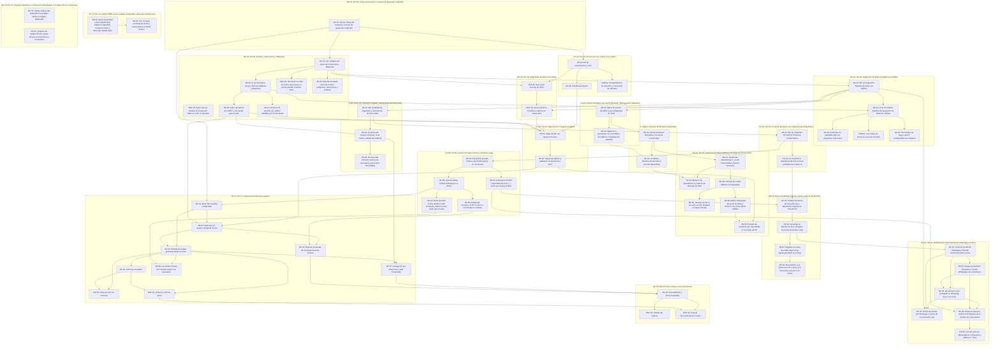

# Grafo de Dependencias -- mant_asc

_Generado automaticamente el 2026-11-12T15:47:09.722Z -- no editar a mano, se sobreescribe en cada publicacion._

```mermaid
graph TD
  subgraph US_1791560828588["RO-01: RO-01: Setup del proyecto y entorno de desarrollo verificable"]
    REQ_1791560828605["RF-01: RO-01: Setup del proyecto y entorno de desarrollo verificable"]
  end
  subgraph US_1791560828711["HU-01: HU-01: Gestión y Alta de ECA y Máquinas"]
    REQ_1791909582859["RF-01: API y Modelo de Datos de Consorcios y Máquinas"]
    REQ_1791910394885["RF-02: UI de Secretaría: Carga y Ficha de Edificios y Máquinas"]
    REQ_1793979090598["RNF-01: Rechazar con 400 los textos que la base no puede guardar (carácter NUL)"]
    REQ_1794000103321["RNF-02: Evitar que las pruebas de integración fallen al correr en paralelo"]
    REQ_1794493276677["RF-03: Importar el listado Excel de la AGC (máquinas, ubicaciones y estados)"]
    REQ_1794493276926["RF-04: Horarios de atención por edificio editables por la Secretaría"]
    REQ_1794493998460["RF-05: Datos operativos del edificio y del equipo para la calle"]
  end
  subgraph US_1791560828789["HU-02: HU-02: Asignación de Roles Tripartitos por Edificio"]
    REQ_1791910395002["RF-01: API de Asignación Tripartita de Roles por Edificio"]
    REQ_1791910395101["RF-02: UI de Secretaría: Pestaña de Asignación de Roles de Trabajo"]
    REQ_1794015939180["RF-03: Evitar que un guardado pise una asignación más nueva"]
    REQ_1794015939447["RNF-01: Leer todas las ternas en una sola consulta"]
    REQ_1794493275904["RF-04: Porcentajes de pago y abono configurables por máquina"]
  end
  subgraph US_1791560828979["HU-04: HU-04: Semáforo de Control Mensual y Reasignación Operativa"]
    REQ_1791910395389["RF-01: Motor de Control Semafórico por Antigüedad de Visita"]
    REQ_1791910395476["RF-02: Mapa de la Secretaría con el semáforo de edificios y reasignación sugerida"]
  end
  subgraph US_1791560829061["HU-05: HU-05: Tablero Dinámico de Monitoreo Backoffice"]
    REQ_1791910395565["RF-01: API de Monitoreo Backoffice y Acciones Comerciales"]
    REQ_1791910395676["RF-02: UI Tablero Dinámico de Monitoreo General (Backoffice)"]
  end
  subgraph US_1791560829152["HU-06: HU-06: Gestión de Fallas Críticas y Deslinde Legal"]
    REQ_1791910396411["RF-01: Recepción de Falla Crítica y Alerta Emergente en Secretaría"]
    REQ_1791910396553["RF-02: Generación de PDF Legal MAICON S.R.L. y envío por email a la ECA"]
    REQ_1794493274550["RF-03: Lista de Fallas Críticas definida por el cliente"]
    REQ_1794493274814["RF-04: Alerta de Falla Crítica también al RT Firmante y alarma sonora hasta que se abra"]
    REQ_1794493275052["RF-05: Estado del ascensor: el RT lo marca y el Firmante lo confirma"]
  end
  subgraph US_1791560829237["HU-07: HU-07: Protocolo de Visitas Fallidas y Recargo de Tercera Visita"]
    REQ_1791910395756["RF-01: Gestión de Advertencias 1 y 2 por Visita Fallida y Email a Consorcio"]
    REQ_1791910395872["RF-02: Bloqueo por Advertencia 3 y Cálculo de Recargo del 45%"]
    REQ_1794013110546["RF-03: Persistir las visitas fallidas en PostgreSQL"]
    REQ_1794493275499["RF-04: Recargo del 45 % una sola vez por máquina no inspeccionada"]
    REQ_1794493275712["RF-05: Edificio bloqueado fuera del recorrido y mínimo 1 día entre visitas fallidas"]
    REQ_1794494000358["RF-06: Pantalla de constancia de visita fallida en el celular del RT"]
  end
  subgraph US_1791560829306["HU-08: HU-08: Panel de Liquidación Rápida y Autorización de Firma AGC"]
    REQ_1791910395959["RF-01: API de Máquinas Asignadas y Autorización de Firma AGC"]
    REQ_1791910396039["RF-02: UI Portal del Usuario Firmante: Lista Limpia y Modal de Auditoría"]
    REQ_1794493276116["RF-03: Rechazo del Firmante vuelve a la Secretaría y plazo de 5 días hábiles"]
  end
  subgraph US_1791560829397["HU-09: HU-09: Portal de Monitoreo de Cobertura para Empresas Conservadoras"]
    REQ_1791910396167["RF-01: API de Cobertura de Flota por Empresa Conservadora"]
    REQ_1791910396255["RF-02: UI Portal ECA: Dashboard de Solo Lectura y Medidor de Cobertura"]
  end
  subgraph US_1791560829468["HU-10: HU-10: Centro de Alertas Críticas y Acuse Legal en Portal ECA"]
    REQ_1791910396649["RF-01: Carteles de Alerta de Fuera de Uso y Reparación Urgente en Portal ECA"]
    REQ_1791910396729["RF-02: Descarga de Remito Técnico y Registro de Acuse de Recibo Legal"]
    REQ_1793980587652["RF-03: Registrar el acuse de recibo legal solo si quedó guardado en la base"]
    REQ_1794493276394["RF-04: Recordatorio a la ECA a las 24 h y aviso a la Secretaría a las 48 h sin acuse"]
  end
  subgraph US_1791560829559["HU-11: HU-11: Notificaciones Automáticas por WhatsApp a la ECA"]
    REQ_1791910396804["RF-01: Conector de API de WhatsApp y Plantilla Formal de Alerta Crítica"]
    REQ_1791910396892["RF-02: Disparo Automático Inmediato (< 5s) de WhatsApp con Link Directo"]
    REQ_1794155773535["RF-03: No informar como entregado un WhatsApp que no se envió"]
    REQ_1794155774018["RF-04: Enviar las alertas por WhatsApp a través de un proveedor real"]
    REQ_1794493273993["RF-05: Enviar los avisos a la ECA solo después de la revisión de la Secretaría"]
    REQ_1794493274385["RF-06: Link del aviso de WhatsApp sin contraseña y válido por 7 días"]
  end
  subgraph US_1794486885074["HU-12: HU-12: Interfaz NEO Linear, Sidebar Colapsable y Buscador Global Inline"]
    REQ_1794486918351["RF-01: Shell Visual NEO Linear (Dark/Light), Sidebar Colapsable, Cobertura Neón y Buscador Global Inline"]
    REQ_1794488168014["RF-02: FIX: Corregir contraste de textos y contenedores en Modo Oscuro"]
  end
  subgraph US_1794486885243["HU-13: HU-13: Claridad Operativa y Limpieza de Obviedades en Portales ECA y Consorcios"]
    REQ_1794486918510["RF-01: Alertas Críticas del Portal ECA sin prefijos obvios ni códigos duplicados"]
    REQ_1794486918616["RF-02: Limpieza de badges obvios y jerga técnica en Portal ECA y Consorcios"]
  end
  subgraph US_1794493997927["HU-14: HU-14: Acceso por rol y sesión en el celular"]
    REQ_1794493998753["RF-01: API de autenticación y roles"]
    REQ_1794493998996["RF-02: Pantalla de ingreso"]
    REQ_1794493999191["RNF-01: Consentimiento de ubicación y revocación de sesiones"]
  end
  subgraph US_1794493998112["HU-15: HU-15: Aislamiento de datos entre ECA"]
    REQ_1794493999440["RNF-01: Row Level Security por ECA"]
    REQ_1794493999670["RNF-02: Acceso de RT y Firmante a edificios de varias ECA"]
  end
  subgraph US_1794493998209["HU-16: HU-16: Mapa del RT y llegada al edificio"]
    REQ_1794493999840["RF-01: Mapa del RT con pines por horario"]
    REQ_1794494000129["RF-02: Tarjeta del edificio y validación de presencia a 30 m"]
  end
  subgraph US_1794493998283["HU-17: HU-17: Inspección técnica por solapas"]
    REQ_1794494000545["RF-01: Motor del checklist configurable"]
    REQ_1794494000700["RF-02: Selección de equipo y pregunta de uso"]
    REQ_1794494000869["RF-03: Reporte de parada de un equipo fuera de servicio"]
    REQ_1794494001043["RF-04: Pantalla de solapa generada desde el motor"]
    REQ_1794494001295["RF-05: Fotos por anomalía"]
    REQ_1794494001529["RF-06: Fallas por piso en Accesos"]
    REQ_1794494001754["RF-07: Navegación por estaciones y sala compartida"]
    REQ_1794494001967["RNF-01: Visita en curso sin señal"]
    REQ_1794494002220["RF-08: Las Fallas Críticas del checklist llegan a la Secretaría"]
  end
  subgraph US_1794493998373["HU-18: HU-18: Cierre, firma y envío del informe"]
    REQ_1794494002445["RF-01: Consolidación y firma en pantalla"]
    REQ_1794494002697["RNF-01: Sellado del informe"]
    REQ_1794494002926["RNF-02: Cola de sincronización del celular"]
  end
  REQ_1791560828605 --> REQ_1791909582859
  REQ_1791909582859 --> REQ_1791910394885
  REQ_1791909582859 --> REQ_1793979090598
  REQ_1791909582859 --> REQ_1794493276677
  REQ_1791910394885 --> REQ_1794493276926
  REQ_1791910394885 --> REQ_1794493998460
  REQ_1791909582859 --> REQ_1791910395002
  REQ_1791910395002 --> REQ_1791910395101
  REQ_1791910394885 --> REQ_1791910395101
  REQ_1791910395101 --> REQ_1794015939180
  REQ_1791910395101 --> REQ_1794015939447
  REQ_1791910395101 --> REQ_1794493275904
  REQ_1791910395002 --> REQ_1791910395389
  REQ_1791910395389 --> REQ_1791910395476
  REQ_1791910395389 --> REQ_1791910395565
  REQ_1791910395565 --> REQ_1791910395676
  REQ_1791910395476 --> REQ_1791910395676
  REQ_1791910396167 --> REQ_1791910396411
  REQ_1791910396411 --> REQ_1791910396553
  REQ_1791910396411 --> REQ_1794493274550
  REQ_1794493274550 --> REQ_1794493274814
  REQ_1794493274550 --> REQ_1794493275052
  REQ_1791910395565 --> REQ_1791910395756
  REQ_1791910395756 --> REQ_1791910395872
  REQ_1791910395676 --> REQ_1791910395872
  REQ_1791910395756 --> REQ_1794013110546
  REQ_1794013110546 --> REQ_1794493275499
  REQ_1794013110546 --> REQ_1794493275712
  REQ_1794494000129 --> REQ_1794494000358
  REQ_1794493275712 --> REQ_1794494000358
  REQ_1791910395002 --> REQ_1791910395959
  REQ_1791910395959 --> REQ_1791910396039
  REQ_1791910396039 --> REQ_1794493276116
  REQ_1791910395959 --> REQ_1791910396167
  REQ_1791910396167 --> REQ_1791910396255
  REQ_1791910396255 --> REQ_1791910396649
  REQ_1791910396553 --> REQ_1791910396649
  REQ_1791910396649 --> REQ_1791910396729
  REQ_1791910396729 --> REQ_1793980587652
  REQ_1793980587652 --> REQ_1794493276394
  REQ_1791910396729 --> REQ_1791910396804
  REQ_1791910396804 --> REQ_1791910396892
  REQ_1791910396804 --> REQ_1794155773535
  REQ_1791910396892 --> REQ_1794155773535
  REQ_1794155773535 --> REQ_1794155774018
  REQ_1791910396804 --> REQ_1794155774018
  REQ_1791910395002 --> REQ_1794155774018
  REQ_1794155773535 --> REQ_1794493273993
  REQ_1791910396892 --> REQ_1794493273993
  REQ_1791910396553 --> REQ_1794493273993
  REQ_1794493273993 --> REQ_1794493274385
  REQ_1794486918351 --> REQ_1794488168014
  REQ_1791560828605 --> REQ_1794493998753
  REQ_1794493998753 --> REQ_1794493998996
  REQ_1794493998753 --> REQ_1794493999191
  REQ_1794493998753 --> REQ_1794493999440
  REQ_1791909582859 --> REQ_1794493999440
  REQ_1794493999440 --> REQ_1794493999670
  REQ_1791910395002 --> REQ_1794493999670
  REQ_1794493998996 --> REQ_1794493999840
  REQ_1794493999670 --> REQ_1794493999840
  REQ_1794493998460 --> REQ_1794493999840
  REQ_1794493276926 --> REQ_1794493999840
  REQ_1794493999840 --> REQ_1794494000129
  REQ_1791560828605 --> REQ_1794494000545
  REQ_1794493274550 --> REQ_1794494000545
  REQ_1794494000129 --> REQ_1794494000700
  REQ_1794494000545 --> REQ_1794494000700
  REQ_1794493998460 --> REQ_1794494000700
  REQ_1794494000700 --> REQ_1794494000869
  REQ_1794493275052 --> REQ_1794494000869
  REQ_1794494000545 --> REQ_1794494001043
  REQ_1794494000700 --> REQ_1794494001043
  REQ_1794494001043 --> REQ_1794494001295
  REQ_1794494001043 --> REQ_1794494001529
  REQ_1794494001295 --> REQ_1794494001529
  REQ_1794494001043 --> REQ_1794494001754
  REQ_1794493998460 --> REQ_1794494001754
  REQ_1794494001043 --> REQ_1794494001967
  REQ_1794494001295 --> REQ_1794494001967
  REQ_1794494001043 --> REQ_1794494002220
  REQ_1794493274814 --> REQ_1794494002220
  REQ_1794494001754 --> REQ_1794494002445
  REQ_1794494000869 --> REQ_1794494002445
  REQ_1794494002445 --> REQ_1794494002697
  REQ_1794494002445 --> REQ_1794494002926
  REQ_1794494001967 --> REQ_1794494002926
```